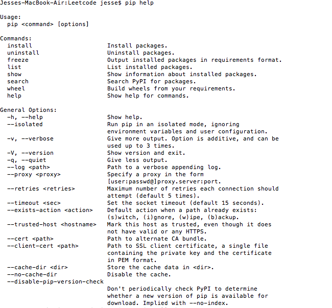
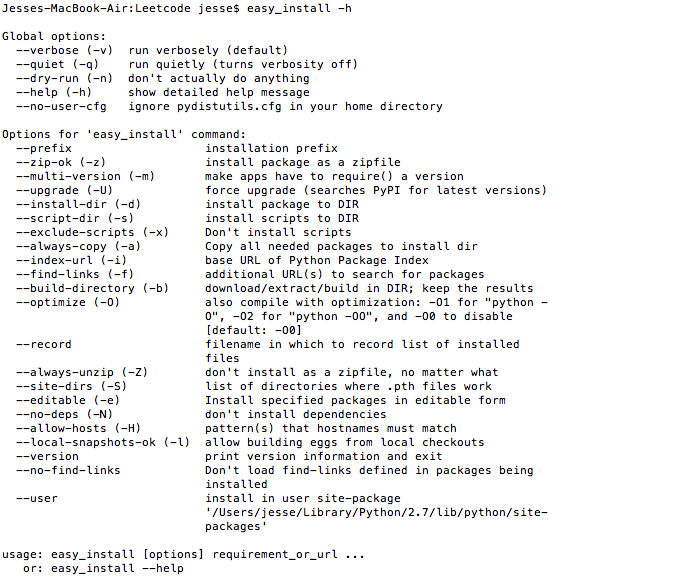
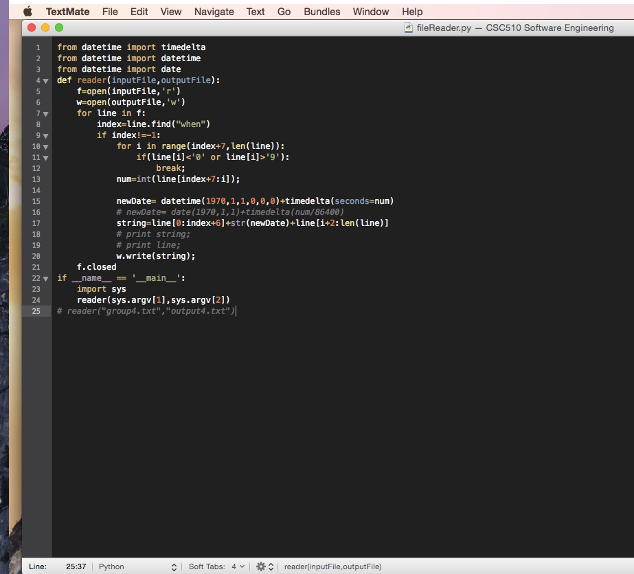
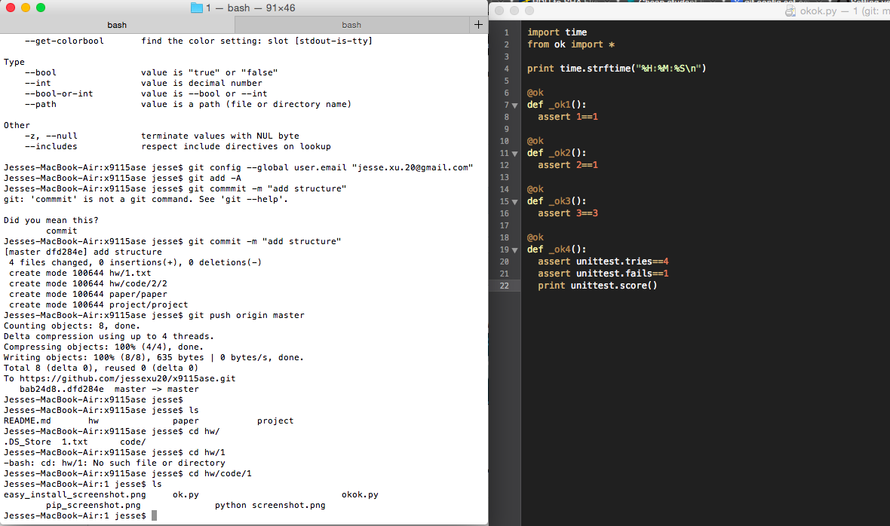
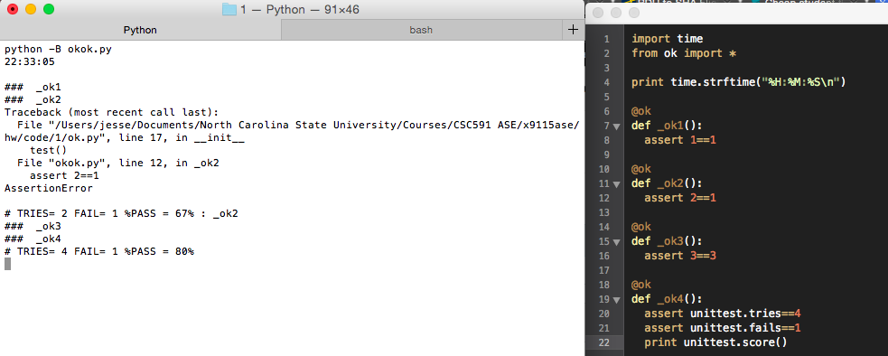
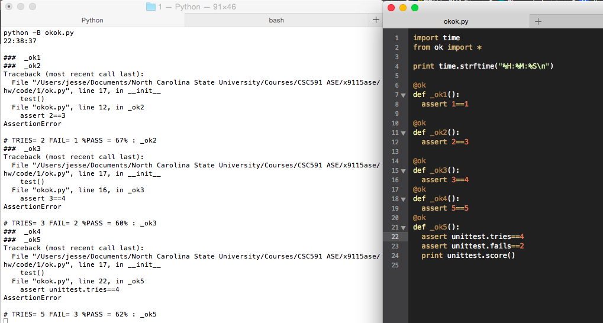

## Homework Code 1

### Screenshots

#### Configure Python, pip, easy_install

##### python screenshot

##### pip_screenshot

##### easy_install_screenshot

#### IDE 

#### Ok test results

##### Unmodified tests

##### Failed tests

##### All-passed tests

