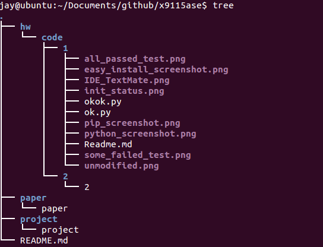

## Homework Code 1
#####Group Members:

- Zhe Yu (azhe825)[student ID: zyu9]

- Zexi Chen (jay1204)[student ID: zchen22]

- Shiqian Xu (jessexu20)[student ID: sxu11]
### Screenshots

#### Configure Python, pip, easy_install
#### repository structure

##### python screenshot

##### pip_screenshot

##### easy_install_screenshot

#### IDE 

#### Ok test results

##### Unmodified tests

##### Failed tests

##### All-passed tests

