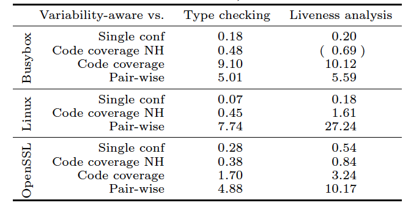
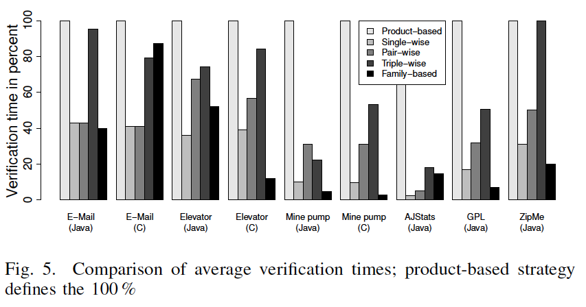
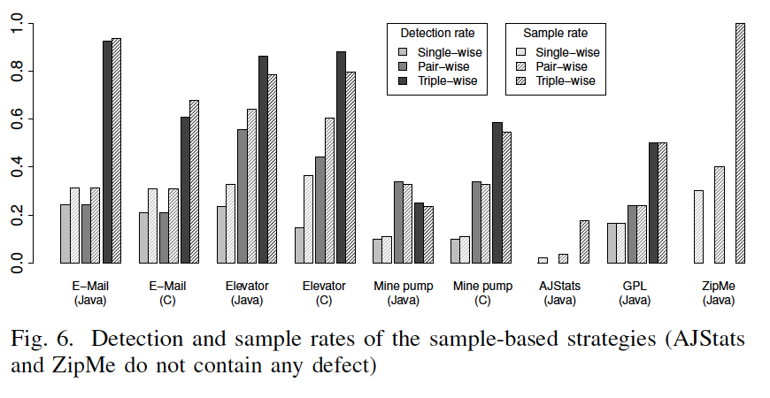
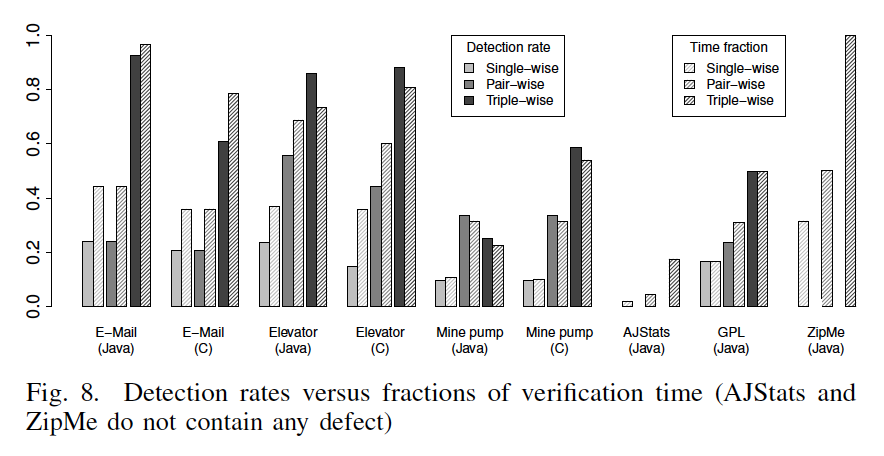

## Software Product Line Engineering - activities of recent five years

### Group Members:

- Zhe Yu (azhe825)[student ID: zyu9]

- Preetham Mahishi Srinath(preems)[student ID: pmahish]

- Shiqian Xu(jessexu20)[student ID: sxu11]

### Abstract
Software Product Line Engineering is gaining momentum in academia and industry. We analyze the activities of recent five years in this field. Starting from a 2011 paper [1], we move both backwards and forwards to explore the field. Twenty papers are selected to review based on their cited numbers. The major research question we are trying to answer is which topic in Software Product Line Engineering is fully exploited and should be closed while which topic is still active and should be explore in the next five years. Our conclusion is that Feature Interaction Detection has already been fully exploited while Product-line Verification is active across the recent years and will stay active in the next five years.
### Introduction
#### Software Product Line Engineering
Software product lines (a.k.a. product families) are gaining momentum in academia and industry. A product line is a family of software systems that are distinguished in terms of features (i.e., end-user–visible units of behavior). The goal of systematic product-line development is to facilitate reuse, manage variability, and support automated product generation. Product Line Engineering is a development paradigm that explicitly addresses reuse by differentiating between two kinds of development processes: In domain engineering, the domain artifacts of the product line are defined and developed. In application engineering, customer- and/or market-specific products are derived from the domain artifacts by binding the variability defined in the domain artifacts according to customer and/or market specific needs. The overall quality of the product line and its derived products mainly depends on the quality of the domain artifacts.

#### Model-checking - Product-line Verification
Model checking is a technique for quality assurance that facilitates the verification of properties (typically specified in CTL) of a system (typically specified in a state transition model). In software engineering for single systems, model checking is an established technique for verifying development artifacts in requirements engineering, design, realization, and test in different domains such as in the automotive or avionic industry.

#### Feature Interaction
Most of the programs provide a features where a user can tailor the program to the application scenario and customize it to his requirements. These customizable feature set is called user-selectable program. A feature interaction occurs when a combination of user-selected features has an unexpected influence of the performance of the program. Two or more features are involved in a feature interaction. It will also include features which are necessary for the features involved in the interaction to work. 

#### How We Explore
Most of the works on Software Product Line are about verification in the recent 5 years. We detect a most highly cited paper of 2011 [1], and use it as a center to explore the area. In the series of our paper reviews, we started from detecting feature interaction to analzying the performance of such feature interactions. Then we date back to 2008 to see what are software engineers working on back then. We see model-checking. At last, we move forward to 2013 to see what are the current active areas of Software Product Line Engineering. Again we see model-checking. Before 2010, feature interaction has not been discussed yet. After 2012, feature interaction is not mentioned frequently. It is a really hot topic in the year of 2011 and 2012, but it does not last long. On the other hand, product line verification - model-checking turns out to be a long-lasting topic that researchers and engineers keep exploring.

### Related Work
#### Feature Interaction Engineering
The two main techniques which were prevalent before were check the feature as far as possible in isolation[4] and check the entire product line in a single pass. These were as old as 2002 and are close to not possible with the modern software product lines. As the features become more and more complicated and closely tied to other features, the isolation becomes impossible. Also verifying the entire product line is challenging, as modern product lines offer too many options for specifications. Other model checking techniques have been proposed by considering variability of models in software product lines, especially state machines, into account and guarantee properties for all products that can be generated[5]. The problem with these is that too abstract for all facets of practical
software design[2]. There is a large research going on automated detection of feature interactions. Some approaches aim at detecting the feature interactions at the specifications level.In 2006, Calder and Miller suggest a pair-wise measurement approach based on the linear temporal logic to detect feature interactions[10]. The use a modelling language called Promeal to specify the SPL behavior. For each pair-wise combination, the model is checked to verify whether the defined properties are still valid. 

The approaches for predicting performance in the case of feature interaction can be classified into two categories namely model based and measurement based. Model based predictions are more common compared to measurement based. Linear and multiple regression
model the relationship between features and a performance output. Based on such a regression model, different estimation methods such as least squares and gradient descent can be used to predict the performance for input parameters. Bayesian networks are used to model the dependencies and probabilistic influence in a network of input parameters and performance. They help to learn the casual relationships between the parameters. These approaches can be used to find the correlation between the input parameters and the measurement output. Principle component analysis gives the direction of the maximal variance in a dataset. This can also be used in finding the PFIs. All of these techniques are very dependent on the scenarios being applied[3]. Measurement based approaches measures a configuration's properties based on the existing knowledge base consisting of measurements of already produced and measured configurations. They try to find the correlation between feature selection and the measurement. Also they do not provide any means to detect the PFIs. In 2010, Liebig analyzed the variability of the 40 SPLs including the nesting of feature code at source code level[11]. This is in contrast with the author's perspective to treat the PFIs as black-box.

### Artifacts
#### Motivation
[1] mainly concentrates on two challenges that arise in feature-oriented software product lines: a) to detect feature interactions based on specifications that do not have global system knowledge; b) to detect feature interactions without the need of generating and checking all individual products. Before feature interaction, [12] concentrate on two challenges that model based SPLE approaches need to address: a) scalable modeling; b) efficient verification of system behavior. [6] aims in extending existing model checking approaches to facilitate the verification of domain artifacts in product line engineering. [7] notices that even though there exist various tools that can support superimposition for code and non-code artifacts, most of the tools are different and dedicated to and embeded in host languages. They mention the integration of the tools should require great effort, which will hinder coordinated efforts to advance composition technology. In [3], authors found that developers can only detect the feature detection only by analyzing the source code and the flow of the program. They should also be able understand the specifications and the use case of each features. This will require substantial domain knowledge, exhaustive analysis capabilities and is subjected to the availability of the source code. This is the problem that [3] tried to solve. In [8], authors want to provide a case study to get rid of the lack of case studies and experiments in this field. They are going to collect and prepare existing and implement further case-study product lines, as well as to develop a model-checking tool chain. In [9], the authors argue that although there are several proposals in variablity-aware analyses, none of them has been applied to large-scale, real-world systems so far. Most of them are limited to academic case studies only. Therefore, the authors think it might be a good way to analyze whether variablity-aware analysis scales to large systems, as it should consider all code and all variations of a system simultaneously.

#### Hypothesis
As in paper *Model Checking Lots of Systems*[12] stated The differences between the systems of an Sofeware Product Line are normally expressed in terms of features. However, this assumes that all the products can be specified using the features, which is foundation of this methodology. Under this assumption, all products or software can be shaped using features purposed by engineers and stakeholders[19] and the specification of the product is just a set of feautres which may be a particular member of the product line.

In comparison between different strategies for production line verfication, there are always assumptions that the system model is optional[8], which means except for one of the feature that author is interested in or commonly noticed among all the compared products, other features are ignored. However, in real life case, this might not be true. As many features would have impact on other ones and thus influencing the final results, also the paper could be too concentrated on some of the features and left alone the other ones, which might also be important and bring insight.
#### One from Issue #8
Need your words

### Results
#### Software Product Line Engineering
Software Product Line engineering, a set of software-intensive systems that share a common, managed set of features satisfying the specific needs of a particular market segment or mission and that are developed from a common set of core assets in a prescribed way[13]. However, a scalable modeling and an efficient method to verify the system behavior needs to be put forward to meet the requirements. A featured transition system(FTS) has been purposed to obtain the behavior of each product of the Software product line. FTS is able to reason about the whole product line, or subsets of it, and model very detailed behavioral variations. Moreover, it could run model checking tool freely and take account into the feature dependencies and incompatibilities. Another model checking technique has been introduced to verify LTL properties for all the products of an SPL at once and would point out the products that violate the properties.  linear-time temporal logic is an infinite sequence of states where each point in time has a unique successor, based on a linear-time perspective[14].
 Using SPL could help to take economic advantage of the fact that many of the products are very similar as planned and deliberate, strategic decisions are made to impact decisions systematically.

#### Model-checking - Product-line Verification
Model-checking technology is used to exhaustively and automatically check whether this model meets a given specification. Typically, one has hardware or software systems in mind, whereas the specification contains safety requirements such as the absence of deadlocks and similar critical states that can cause the system to crash. Model checking is a technique for automatically verifying correctness properties of finite-state systems and specifically product line verification is one type of model checking technology. In product line verification, there are three strategies which are product-based, sample-based and family based strategy. However, before [8], there is no comparison between them in a controlled setting, therefore, [8] provides case studies and experiments on that. And they have created an analytical model to describe the trade-offs of the individual verification strategies and given promising results after revisiting the discussion of the strengths and weaknesses of sample-based and family-based strategies, shown in figure 5 , figure 6, figure 8. Furthermore, a generic conclusion is given that the success of a sample-based strategy depends on the defect and sample rates, whereas the success of the family-based strategy depends on the similarity between products. Also, sampling can save verification time but could lead to miss the defective products.

#### Feature Interaction
Feature interaction has not been discussed until 2010 [1]. The authors of the paper[2] aimed at detecting the dependencies and feature interactions in a software generated by the product line. They extended a the lightweight modeling language Alloy with support for feature oriented design and call the extension of Alloy as FeatureAlloy. They claim that the FeatureAlloy facilitates separation of concerns, variability, and reuse of models of individual features and helps detecting semantic dependences and feature interactions[2]. The authors of the paper[1] intended to verify all the products of the software product line using product-line-verification techniques. The challenge consisted of two parts, detecting feature interaction based on specifications without having the global system knowledge and detecting feature interactions without needing to generate all possible products of the product line. As the development in the field of feature interaction engineering continued, new problems surfaced above. One of which is predicting the performance in the software when there is a feature interaction. The authors came up with a method that automatically detects performance feature interactions to improve prediction accuracy[3]. They propose three heuristics which reduces the number of measurements required to detect the feature interactions.

#### Scalable Analysis of Variable Software
Variability Analysis, known as family-based analysis, is not to generate and analysis variants separately but to directly analyze the variable code base by utilizing some configuration knowledge. Although, there are several proposals on this theme, there are no real-life, large-scale systems being implemented due to its potential challenges. It requires more effort than traditional analysis of a single system as all local variants are considered into the analysis. But the effort is worth taken as it could avoid analyzing the common code by taking advantage of similarities among variants. Therefore, [9] proposed a way to detect whether variability-aware analysis scales to large systems, as it should consider all code and all variations of a system simultaneously. Before [9], they have already come out with a sort of Java libraries which could handle the scaling in Java written project such as Featherweight Java[15,16], Lightweight Java[17], the lambda calculus[18], and other dialects of Java. They also took advantage of other researchers' variability-aware approaches for data-flow analysis using liveness analysis, which is a traditional data-flow analysis to compute whether variables are live, which may be read before being written again for a given statement. Its result can be used to conservatively detect dead code, useless code. A practical, scalable, variability-aware and sampling-based analysis for real-world, large-scale systems written in C is finally purposed. Experiments on large-scale system including Linux Kernel is taken and the performance of variability-aware analysis outperforms some of the sampling heuristics and still being complete and some of the limitations on pair-wise, sampling heuristics are found,as shown in the below figure. Also some future work regarding to other large system should also be included to test the achieved results.

### Recommended Path
For feature interaction, many researchers have solved various problems with feature interaction from detecting, verifying and analyzing the performance of the softwares from product lines with different specifications. But many claim that these approaches will work only on specific use cases and cannot be generalized to all kinds of softwares. We believe that the future research should be towards generalizing the various approaches presented by authors. Apel and Sven, the authors of FutureAlloy believe that the its capabilities can be enhanced to check the features in isolation. This would require a syntactic and semantic interface mechanism. Also they believe that the future research should be about taking advantage of the FeatureAlloy specifications for code generation and verification[2]. 

For verification, Siegmund and Norbert presented a method which allows to accurately predict the performance of customized and generated programs[3]. They present a mathematical model for conducting the experiments and evaluating the performance. They demonstrate the accuracy of 95% through their experiments[3]. They conduct the experiments on softwares built using static-typed languages. We believe that this can be extended to dynamic-typed languages. The experiments and changes to the modeling should be presented for dynamic typed languages. They should also establish a baseline accuracy number to be expected for all software programs instead of just presenting a experimental accuracy figure.

### Conclusion
Model checking is always hot in software product line engineering. It is a crucial part to the study of software product line. Various methods have been proposed in verification but still, more works are required. We can predict that the focus of software product line engineering will still be the verification problem.
Detection of feature interaction has solved various problems in software product line engineering, but many claim that these approaches will work only on specific use cases and cannot be generalized to all kinds of softwares. As a phenomena, we detect that the activities in feature interaction detection have decreased dramatically after 2012. Therefore we do not suggest a following up work on that.

### Threats to Validity
We only explore the highly cited 20 papers to draw our conclusion. This can be misleading cause many really good papers are not highly cited. Also, we only explore the field based on [1] as the centre, this is only a small population of the whole picture. It is dangerous to believe this conclusion but we hope our work can provide some insights of how feature interaction is used and how important verification is in software product line engineering.

### Future works
We will continue on exploring the activities in software product line engineering. Mainly focus on the development of verification methods after 2013. Judging from our previous work, this is a topic that has last and will still last long. The first thing need to be done in this area is to summarize the existing results and generate a baseline result.

### References
[1]  S. Apel, H. Speidel, P. Wendler, A. von Rhein, and D. Beyer, "Detection of feature interactions using feature-aware verification", in ASE. IEEE, 2011, pp. 372-375.

[2]  Apel, Sven, et al. "Detecting dependences and interactions in feature-oriented design." Software Reliability Engineering (ISSRE), 2010 IEEE 21st International Symposium on. IEEE, 2010.

[3]  Siegmund, Norbert, et al. "Predicting performance via automated feature-interaction detection." Proceedings of the 34th International Conference on Software Engineering. IEEE Press, 2012.

[4]  H. Li, S. Krishnamurthi, and K. Fisler. Verifying Cross-Cutting Features as Open Systems. In Proc. FSE, pages 89–98. ACM, 2002.

[5] A. Gruler, M. Leucker, and K. Scheidemann, “Calculating and Modeling Common Parts of Software Product Lines,” in Proc. Int. Software Product Line Conference (SPLC). IEEE CS, 2008, pp. 203–212.

[6] Lauenroth, Kim, Klaus Pohl, and Simon Toehning. "Model checking of domain artifacts in product line engineering." In Automated Software Engineering, 2009. ASE'09. 24th IEEE/ACM International Conference on, pp. 269-280. IEEE, 2009.

[7] Apel, Sven, Christian Kastner, and Christian Lengauer. "FEATUREHOUSE: Language-independent, automated software composition." In Proceedings of the 31st International Conference on Software Engineering, pp. 221-231. IEEE Computer Society, 2009.

[8] Apel, Sven, Alexander von Rhein, Philipp Wendler, Armin Größlinger, and Dirk Beyer. "Strategies for product-line verification: Case studies and experiments." In Proceedings of the 2013 International Conference on Software Engineering, pp. 482-491. IEEE Press, 2013.

[9] Liebig, Jörg, Alexander von Rhein, Christian Kästner, Sven Apel, Jens Dörre, and Christian Lengauer. "Scalable analysis of variable software." In Proceedings of the 2013 9th Joint Meeting on Foundations of Software Engineering, pp. 81-91. ACM, 2013.

[10] M. Calder and A. Miller, “Feature interaction detection by pairwise analysis of LTL properties: A case study,” Form. Methods Syst. Des., vol. 28, no. 3, pp. 213–261, 2006.

[11] J. Liebig, S. Apel, C. Lengauer, C. Kastner, and M. Schulze, ¨“An analysis of the variability in forty preprocessor-based software product lines,” in ICSE. ACM, 2010, pp. 105–114

[12] Classen, Andreas, Patrick Heymans, Pierre-Yves Schobbens, Axel Legay, and Jean-François Raskin. "Model checking lots of systems: efficient verification of temporal properties in software product lines." In Proceedings of the 32nd ACM/IEEE International Conference on Software Engineering-Volume 1, pp. 335-344. ACM, 2010.

[13] A Framework for Software Product Line Practice, Version 5.0 http://www.sei.cmu.edu/productlines/frame_report/what.is.a.PL.htm

[14] LINEAR TEMPORAL LOGIC (LTL) Rehab Ashari Sahar Habib http://www.cs.colostate.edu/~france/CS614/Slides/Ch5-Summary.pdf

[15] S. Apel, C. K¨astner, A. Gr¨oßlinger, and C. Lengauer. Type Safety for Feature-Oriented Product Lines.Automated Software Engineering, 17(3):251–300, 2010

[16] C. K¨astner, S. Apel, T. Th¨um, and G. Saake. Type Checking Annotation-Based Product Lines. ACM Trans. Software Engineering and Methodology, 21(3):1–39, 2012.

[17] B. Delaware, W. Cook, and D. Batory. Fitting the Pieces Together: A Machine-Checked Model of Safe Composition. In Proc. Int. Symp. Foundations of Software Engineering (FSE), pages 243–252. ACM, 2009.

[18] S. Chen, M. Erwig, and E. Walkingshaw. An Error-Tolerant Type System for Variational Lambda Calculus. In Proc. Int. Conf. Functional Programming (ICFP), pages 29–40. ACM, 2012.

[19] A. Classen, P. Heymans, and P.-Y. Schobbens. What's in a feature: A requirements engineering perspective. In FASE'08, Held as Part of ETAPS'08, volume 4961 of LNCS, pages 16{30. Springer, 2008.